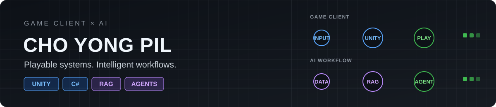

**Unity로 플레이 경험을 만들고, RAG와 AI Agent로 게임 제작 workflow를 설계합니다.**

[이메일](mailto:qldpdml12@gmail.com) · [Slime Ranch 플레이](https://ys143112.github.io/Slime/)

---

## 대표 작업

| 프로젝트 | 담당·구현 | 기술 |
| --- | --- | --- |
| [Slime Ranch](https://github.com/ys143112/Slime) | 팀 프로젝트 · Pixel art asset AI 생성·검수, AI-assisted procedural map generator·기본 UI layout 구현 | `Unity` `C#` `AI Asset Pipeline` |
| [Game Develop Orchestration](https://github.com/JugleGame/Game-Develop-Orchestration) | 상용 AI Agent 기반 game development workflow · LangGraph 도입 후 Host Agent + MCP 구조로 단순화 | `Python` `MCP` `AI Agent` |
| [Game Planning RAG](https://github.com/JugleGame/Game-Planning-RAG) | 본인 구현 · 게임 설계 카드 검증, section-level hybrid retrieval, Neon Postgres/pgvector mirror·evaluation | `Python` `RAG` `Neon` `pgvector` |

## 장비 구성 · Loadout

  

  <strong>Game Client</strong> · Unity · Unreal Engine · C# · Procedural Generation 
  <strong>AI Engineering</strong> · Python · RAG · AI Agent Orchestration · MCP · Postgres/pgvector

## 플레이어 통계 · Player Stats

  

